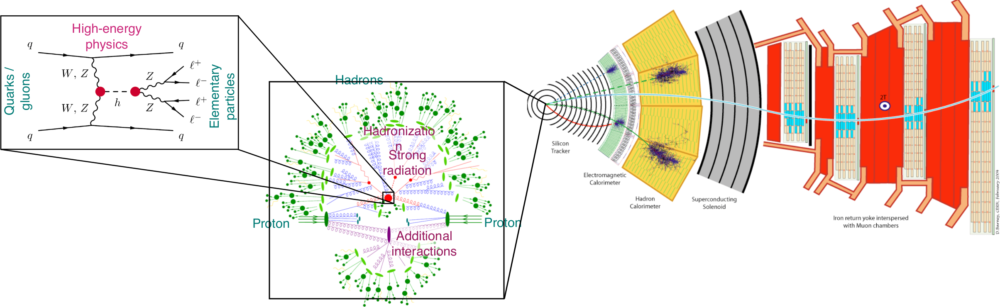

class: middle, center, title-slide
count: false

# Constraining Effective Field Theories with Machine Learning

ATLAS ML workshop, October 15-17 2018

  

Gilles Louppe 
[g.louppe@uliege.be](mailto:g.louppe@uliege.be)

with Johann Brehmer, Kyle Cranmer and Juan Pavez.

---

class: middle

.center.width-70[]

.footnote[Refs:
[GaltonBoard.com](http://galtonboard.com)
]

???

Each path is a Bernoulli trial.

---

class: middle

.center.width-70[]

The probability of ending in bin $x$ corresponds to the total probability of all the paths $z$ from start to $x$.

$$\begin{aligned}
p(x | \theta)
= \int p(x,z|\theta) dz
= \begin{pmatrix}
n \\\\
x
\end{pmatrix}
\theta^x (1-\theta)^{n-x}
\end{aligned}$$

---

class: middle, center

What if we shift or remove some of the pins?

.width-60[]

---

class: middle

The probability of ending in bin $x$ still corresponds to the total probability of all the paths $z$ from start to $x$:
$$p(x|\theta) = \int p(x,z|\theta) dz$$

- But this integral can no longer be simplified analytically!
- As $n$ grows larger, evaluating $p(x\|\theta)$ becomes **intractable** since the number of paths grows combinatorially.
- Generating observations remains easy: drop balls.

---

class: middle

The Galton board is a metaphore for the simulator-based scientific method:
- the Galton board device is the equivalent of the scientific simulator
- $\theta$ are parameters of interest
- $z$ are stochastic execution traces through the simulator
- $x$ are observables

Inference in this context requires **likelihood-free algorithms**.

---

class: middle

.center.width-100[]

.footnote[Credits:
Johann Brehmer
]

---

class: middle

.center.width-70[]

  
.center.width-100[]

.center.italic[The Galton board of particle physics]

---

# Likelihood-free inference methods

.grid[
.kol-1-2[
## Treat the simulator as a black box

- Histograms of observables, Approximate Bayesian computation.
    - <i>Rely on summary statistics.</i>
- Machine learning algorithms
    - <i>Density estimation, Cᴀʀʟ, autoregressive models, normalizing flows, etc.</i>

 
.center.width-40[]
]
.kol-1-2[
## Use latent structure

- Matrix Element Method, Optimal Observables, Shower deconstruction, Event Deconstruction.
    - <i>Neglect or approximate shower + detector, explicitly calculate $z$ integral.</i>
- **\*new\*** Mining gold from the simulator.
    - <i>Leverage matrix-element information + Machine Learning.</i>
]
]

---

# Mining gold from simulators

.center[
  
.width-70[]

$p(x|\theta)$ is usually intractable.

What about $p(x,z|\theta)$?]

---

  
.center.width-70[]

$$
\begin{aligned}
p(x,z|\theta) &= p(z\_1|\theta)p(z\_2|z\_1,\theta) \ldots p(z\_T|z\_{<T},\theta)p(x|z\_{\leq T},\theta) \\\\
&= p(z\_1|\theta)p(z\_2|\theta) \ldots p(z\_T|\theta) p(x|z\_T) \\\\
&= p(x|z\_T) \prod\_{t} \theta^{z\_t} (1-\theta)^{1-z\_t}
\end{aligned}
$$

.center[This can be computed as the ball falls down the board!]

---

class: middle

As the trajectory $z = z\_1, ..., z\_T$ and the observable $x$ are emitted, it is often possible:
- to calculate the *joint likelihood* $p(x,z|\theta)$;
- to calculate the *joint likelihood ratio* $r(x,z|\theta\_0, \theta\_1)$;
- to calculate the *joint score* $t(x,z|\theta\_0) = \nabla\_\theta \log p(x,z|\theta) \big|\_{\theta\_0}$.

We call this process **mining gold** from your simulator!

---

# Rᴀsᴄᴀʟ

 
 
 

.center.width-100[]

.footnote[
Refs: Brehmer et al, 2018 ([arXiv:1805.12244](https://arxiv.org/pdf/1805.12244.pdf))
]

---

class: middle

# Constraining Effective Field Theories, effectively

---

# LHC processes

 

.width-100[]

.footnote[Credits:
Johann Brehmer
]

---

count: false

# LHC processes

 

.width-100[]

.footnote[Credits:
Johann Brehmer
]

---

count: false

# LHC processes

 

.width-100[]

.footnote[Credits:
Johann Brehmer
]

---

count: false

# LHC processes

 

.width-100[]

.footnote[Credits:
Johann Brehmer
]

---

class: middle

$$p(x|\theta) = \underbrace{\iiint}\_{\text{intractable}} p(z\_p|\theta) p(z\_s|z\_p) p(z\_d|z\_s) p(x|z\_d) dz\_p dz\_s dz\_d$$

---

class: middle

.bold[Key insights]:
- The distribution of parton-level momenta
$$p(z\_p|\theta) = \frac{1}{\sigma(\theta)} \frac{d\sigma(\theta)}{dz\_p},$$
where $\sigma(\theta)$ and $\tfrac{d\sigma(\theta)}{dz\_p}$ are the total and differential cross sections, is tractable.
- Downstream processes $p(z\_s|z\_p)$, $p(z\_d|z\_s)$ and $p(x|z\_d)$ do not depend on $\theta$.

 

$\Rightarrow$ This implies that both $r(x,z|\theta\_0,\theta\_1)$ and $t(x,z|\theta\_0)$ can be mined. E.g.,
$$
\begin{aligned}
r(x,z|\theta\_0,\theta\_1) &= \frac{p(z\_p|\theta\_0)}{p(z\_p|\theta\_1)} \frac{p(z\_s|z\_p)}{p(z\_s|z\_p)} \frac{p(z\_d|z\_s)}{p(z\_d|z\_s)} \frac{p(x|z\_d)}{p(x|z\_d)} = \frac{p(z\_p|\theta\_0)}{p(z\_p|\theta\_1)}
\end{aligned}$$

---

# Proof of concept

 

.center.width-70[]
.caption[Higgs production in weak boson fusion]

 

Goal: Constraints on two theory parameters:
$$\mathcal{L} = \mathcal{L}\_{SM} + \underbrace{\frac{f\_W}{\Lambda^2}} \; \frac{ig}{2} \, (D^\mu\phi)^\dagger \, \sigma^a \, D^\nu\phi \; W\_{\mu\nu}^a - \underbrace{\frac{f\_{WW}}{\Lambda^2}} \; \frac{g^2}{4} \, (\phi^\dagger\phi) \; W^a_{\mu\nu} \, W^{\mu\nu\, a}$$

.footnote[Credits:
Johann Brehmer
]

---

# Precise likelihood ratio estimates

 
.center.width-100[]

.footnote[Credits:
Johann Brehmer
]

---

# Increased data efficiency

 
.center.width-100[]

.footnote[Credits:
Johann Brehmer
]

---

# Better sensitivity

.center.width-60[]

.footnote[Credits:
Johann Brehmer
]

???

Estimated expected likelihood ratio based on a traditional doubly differential
histogram analysis (orange dotted) and the new Rascal technique (red dashed).

We show a line in
parameter space with particularly large difference between the methods.

The grey dotted line
marks the expected exclusion limit at 95% CL according to asymptotics.

- The vertical arrow shows
how much more data the histogram approach requires to constrain the same parameter point with
the same significance.
- The horizontal arrow demonstrates the increased physics reach of the
machine-learning-based method.  

---

# Stronger bounds

 
.center.width-100[]

.footnote[Credits:
Johann Brehmer
]

???

Expected exclusion contours at 68% CL (innermost lines),
95% CL, and 99.7% CL (outermost lines) based on the Neyman construction. In both panels, we
assume 36 observed events and the SM to be true.

---

# Summary

- Many LHC analysis (and much of modern science) are based on "likelihood-free" simulations.
- New inference algorithms:
    - Leverage more information from the simulator
    - Combine with the power of machine learning
- First application to LHC physics: stronger EFT constraints with less simulations.

.grid[
.kol-2-3[ .center.width-100[]]
.kol-1-3[.center.width-100[]]
]

---

# Collaborators

   

.center[
  &nbsp;
 &nbsp;

]

 
.caption[Johann Brehmer, Kyle Cranmer and Juan Pavez]

---

# References

- Stoye, M., Brehmer, J., Louppe, G., Pavez, J., & Cranmer, K. (2018). Likelihood-free inference with an improved cross-entropy estimator. arXiv preprint arXiv:1808.00973.
- Brehmer, J., Louppe, G., Pavez, J., & Cranmer, K. (2018). Mining gold from implicit models to improve likelihood-free inference. arXiv preprint arXiv:1805.12244.
- Brehmer, J., Cranmer, K., Louppe, G., & Pavez, J. (2018). Constraining Effective Field Theories with Machine Learning. arXiv preprint arXiv:1805.00013.
- Brehmer, J., Cranmer, K., Louppe, G., & Pavez, J. (2018). A Guide to Constraining Effective Field Theories with Machine Learning. arXiv preprint arXiv:1805.00020.
- Cranmer, K., Pavez, J., & Louppe, G. (2015). Approximating likelihood ratios with calibrated discriminative classifiers. arXiv preprint arXiv:1506.02169.
- Cranmer, K. (2018). Learning the likelihood function: moving from classification to inference. [[Indico](https://indico.cern.ch/event/737584/#2-learning-the-likelihood-func)]

---

class: end-slide, center
count: false

The end.
